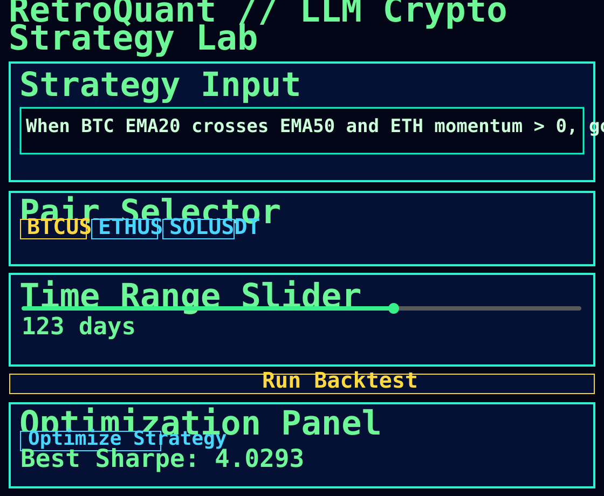

# RetroQuant

RetroQuant is a lightweight **LLM-native crypto strategy optimization platform**.

## UI Preview



## Repo Structure

- `frontend/` – Next.js pixel-style dashboard UI.
- `backend/` – FastAPI app and route layer.
- `engine/` – backtesting + pair-graph engines.
- `optimizer/` – LLM-style mutation optimizer.
- `dsl/` – Natural-language compiler + JSON DSL schema.
- `data/` – DuckDB + Parquet OHLCV data layer.

## Backend API

- `POST /compile-strategy`
- `POST /run-backtest`
- `POST /optimize`
- `GET /results/{id}`

## System-Design Alignment Check

- ✅ Frontend (Pixel UI) → FastAPI routes is implemented.
- ✅ Strategy compiler outputs structured JSON DSL.
- ✅ Backtest engine outputs ROI / Sharpe / Max Drawdown / Win Rate / Trade Count.
- ✅ Optimizer uses iterative feedback-driven mutations (not grid-only).
- ✅ Data layer uses Parquet storage and DuckDB reads.
- ✅ Pair Graph Engine is included (`engine/pair_graph.py`) and fed into backtest metrics (`pair_graph_score`).
- ⚠️ Strategy compiler is currently rule-based heuristic; it is LLM-ready but not wired to an external LLM provider yet.
- ⚠️ Backtest core is currently Python (Pandas/Numpy), not Rust.

### Quick Start (backend)

```bash
pip install -r requirements.txt
uvicorn backend.main:app --reload
```

### Quick Start (frontend)

```bash
cd frontend
npm install
npm run dev
```

## JSON DSL Example

```json
{
  "signal": "ema_cross",
  "pair": "BTCUSDT",
  "fast": 20,
  "slow": 50,
  "filter": { "eth_momentum": ">0" },
  "execution": "long"
}
```


## License

This project is licensed under the Apache License 2.0. See `LICENSE`.
